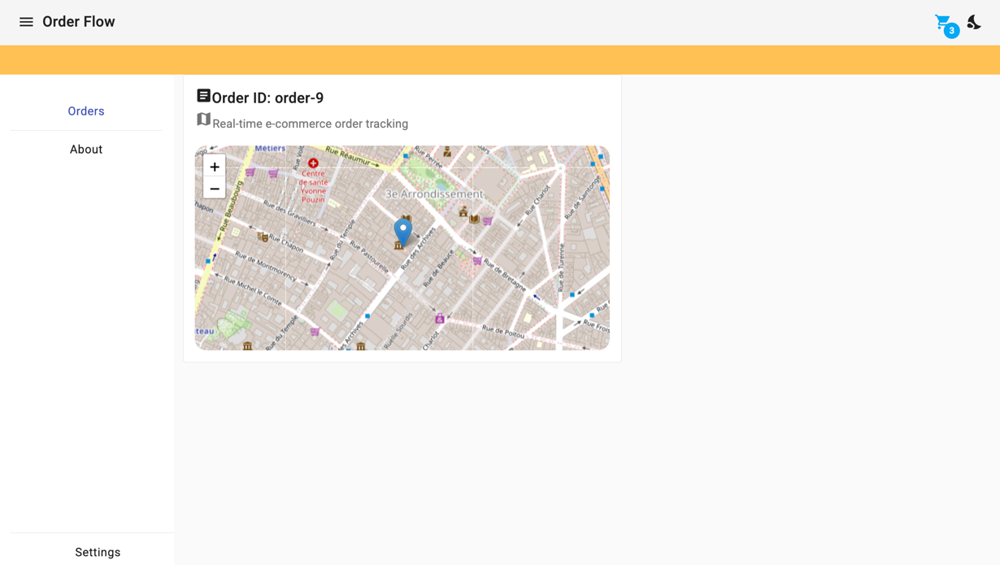
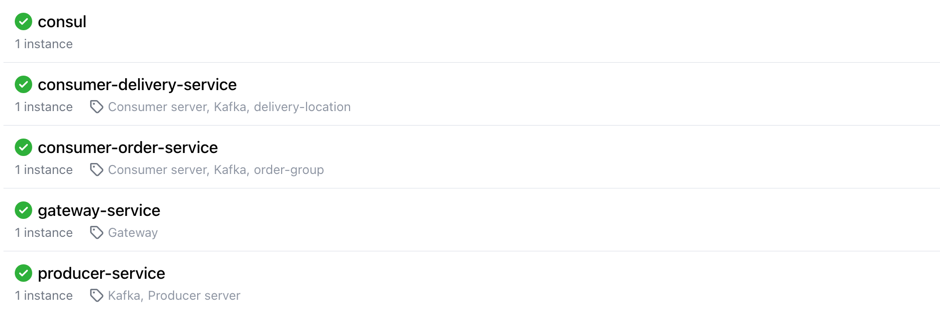

# OrderFlow
OrderFlow is a real-time e-commerce order tracking platform built with **Spring Boot**, **Spring Cloud**, **Apache Kafka**, and **Angular**.
It enables seamless order creation, real-time delivery tracking, and live updates through event streaming.



## Technology

Technology Stack used for development:

* [Spring Boot](https://spring.io/projects/spring-boot)
* [Spring Cloud](https://spring.io/projects/spring-cloud)
* [Apache Kafka](https://kafka.apache.org/)
* [Consul](https://developer.hashicorp.com/consul)
* [Angular](https://angular.io/)
* [Cypress](https://docs.cypress.io/api/commands/url)
* [Jest](https://jestjs.io/)
* [Cucumber](https://cucumber.io/)


## Services


## Components
```md
                            ┌─────────────────────┐
                            │     Frontend UI     │
                            │ (Angular + Leaflet) │
                            └─────────┬───────────┘
                                      │  (REST / WebSocket)
                                      ▼
                          ┌────────────────────────────┐
                          │     Gateway Service        │
                          │ (Spring Cloud Gateway)     │
                          └─────────┬──────────────────┘
                                    │
                                    ▼
                         ┌───────────────────────────────┐
                         │        Apache Kafka           │
                         │  (order-topic, delivery-topic)│
                         │    Simulates orders           │
                         │       &  driver location      │
                         └─────────┬─────────┬───────────┘
                                   │         │
             ┌─────────────────────┘         └─────────────────────┐
             ▼                                                     ▼
┌────────────────────────────┐                 ┌────────────────────────────┐
│  Consumer Order Service    │                 │ Consumer Delivery Service  │
│ (Group: order-group)       │                 │ (Group: delivery-group)    │
│ - Consumes new orders      │                 │ - Consumes driver location │
└────────────────────────────┘                 └────────────────────────────┘

                        ┌──────────────────────────────┐
                        │        Consul Registry       │
                        │ (Service Discovery & Health) │
                        └──────────────────────────────┘

                        ┌──────────────────────────────┐
                        │          Kafka UI            │
                        │      (Topic inspection)      │
                        └──────────────────────────────┘

```

#### Docker services

| Services                   | Port | Role                                                                                    |
|----------------------------|------|-----------------------------------------------------------------------------------------|
| gateway-service            | 8000 | API Gateway for routing requests to the appropriate microservice                        |
| producer-service           | 9000 | Publishes order creation events to Kafka                                                |
| consumer-order-service     | 9001 | Consumes order events (**order-topic**)                                                 |
| consumer-delivery-service  | 9002 | Consumes delivery events (**delivery-topic**) and simulates real-time driver locations  |
| consul                     | 8500 | Service registry for discovery & health checks                                          |
| kafka                      | 9092 | Message broker for streaming data (Kraft Mode)                                          |
| zookeeper                  | 2181 | Coordinates Kafka broker                                                                |
| kafka-ui                   | 8501 | Web UI to monitor Kafka topics and consumers                                            |

#### Data Flow Summary

1. **Producer Service** → Publishes new orders to Kafka (order-topic). 
2. **Consumer Order Service** → Processes order events
   1. Listens to order-topic (order list updates).
   2. Broadcasts order list in real time to connected WebSocket clients.
3. **Consumer Delivery Service** → 
    1. Listens to delivery-topic (driver position updates). 
    2. Broadcasts updates in real time to connected WebSocket clients. 
4. **Angular Frontend** → Displays orders and live locations on a map (Leaflet).

#### Running the Application
In order to run this starter application locally you need to have [Docker](https://www.docker.com/) and [Docker-Compose](https://docs.docker.com/compose/install/) installed on your machine.
Clone the repository:
```bash
git clone https://github.com/romdhanisam/OrderFlow.git
cd OrderFlow
```
```bash
docker-compose up --build
```
This command will build and start all the services in the docker-compose.yml file, including:

1. **Kafka**: The event streaming platform that enables real-time delivery tracking. 
2. **Consul**: The service registry for dynamic service discovery. 
3. **Spring Cloud Gateway**: Handles routing and load balancing between services. 
4. **Producer and Consumer Services**: Handle order events and delivery tracking. 
5. **Frontend**: Provides the Angular UI to display the order status and driver locations.

#### Gateway Service Configuration

The **gateway-service** is a Spring Cloud Gateway application that acts as the entry point for all client requests. 
It routes incoming HTTP requests to the appropriate microservices.

Example (application.yml)
```yaml
spring:
   cloud:
      gateway:
         server:
            webflux:
               discovery:
                  locator:
                     enabled: true
               routes:
                  - id: producer-service
                    uri: lb://producer-service
                    predicates:
                       - Path=/api/**
                  - id: consumer-order-service
                    uri: lb://consumer-order-service
                    predicates:
                       - Path=/ws-orders/**
                  - id: consumer-delivery-service
                    uri: lb://consumer-delivery-service
                    predicates:
                       - Path=/ws-delivery/**
```
