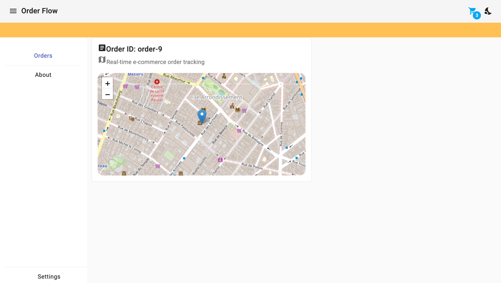
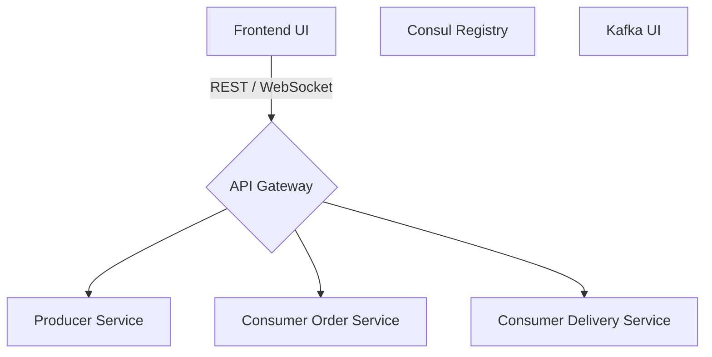

# Welcome to OrderFlow

OrderFlow is a real-time e-commerce order tracking platform built with **Spring Boot**, **Spring Cloud**, **Apache Kafka**, and **Angular**.
It enables seamless order creation, real-time delivery tracking, and live updates through event streaming.

{ width="900px" }

## Components



## Running the Application
In order to run this starter application locally you need to have [Docker](https://www.docker.com/) and [Docker-Compose](https://docs.docker.com/compose/install/) installed on your machine.
Clone the repository:
```bash
git clone https://github.com/romdhanisam/OrderFlow.git
cd OrderFlow
```
```bash
docker-compose up --build
```
This command will build and start all the services in the docker-compose.yml file, including:

1. **Kafka**: The event streaming platform that enables real-time delivery tracking.
2. **Consul**: The service registry for dynamic service discovery.
3. **Spring Cloud Gateway**: Handles routing and load balancing between services.
4. **Producer and Consumer Services**: Handle order events and delivery tracking.
5. **Frontend**: Provides the Angular UI to display the order status and driver locations.
