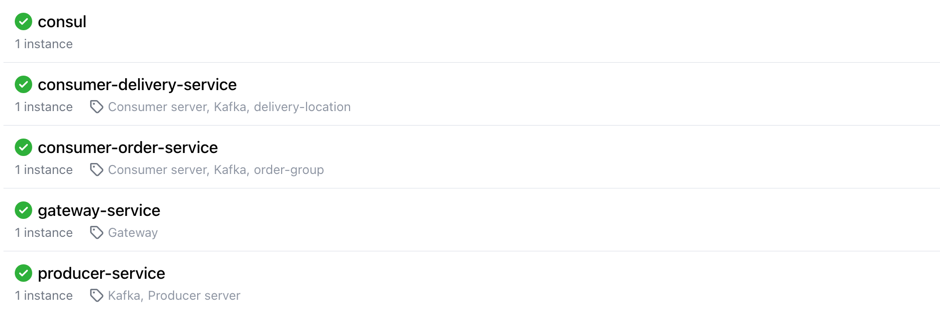

## Docker services

| Services                   | Port | Role                                                                                    |
|----------------------------|------|-----------------------------------------------------------------------------------------|
| gateway-service            | 8000 | API Gateway for routing requests to the appropriate microservice                        |
| producer-service           | 9000 | Publishes order creation events to Kafka                                                |
| consumer-order-service     | 9001 | Consumes order events (**order-topic**)                                                 |
| consumer-delivery-service  | 9002 | Consumes delivery events (**delivery-topic**) and simulates real-time driver locations  |
| consul                     | 8500 | Service registry for discovery & health checks                                          |
| kafka                      | 9092 | Message broker for streaming data (Kraft Mode)                                          |
| zookeeper                  | 2181 | Coordinates Kafka broker                                                                |
| kafka-ui                   | 8501 | Web UI to monitor Kafka topics and consumers                                            |
